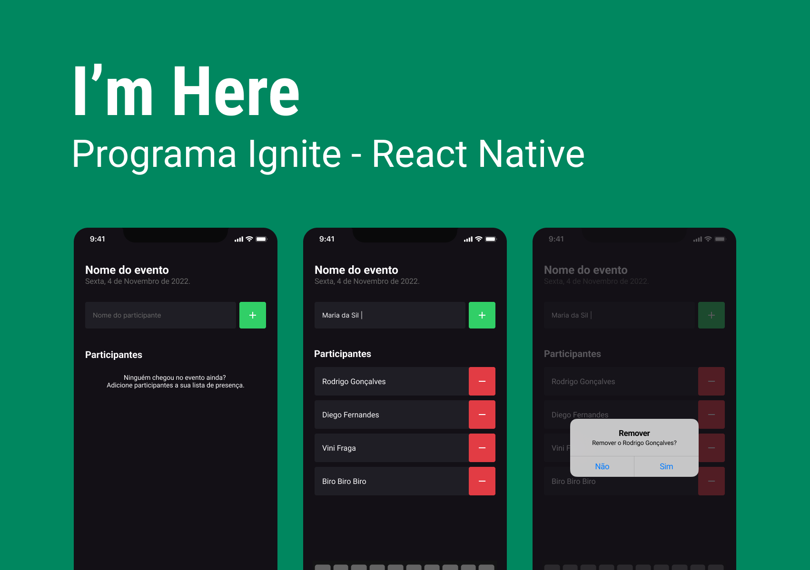
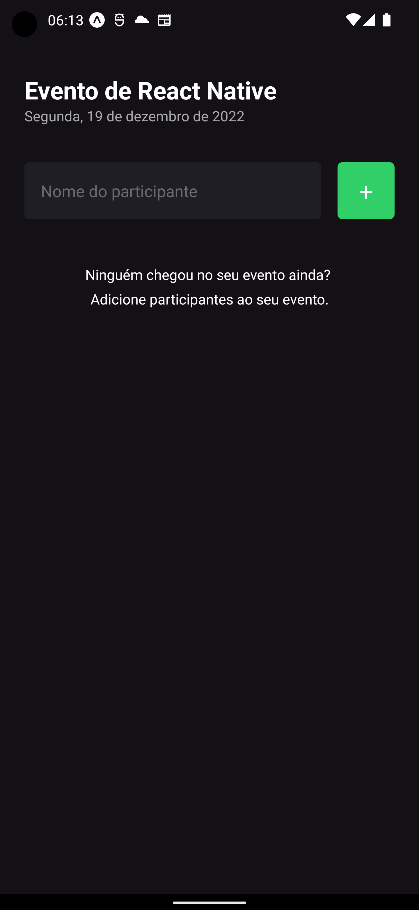
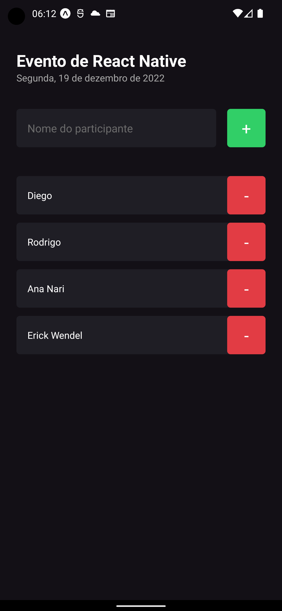

<h1 align="center">
   I'm Here
</h1>

<p align="center">


</p>

---

<p align="center">
  <a href="#-projeto">Projeto</a>&nbsp;&nbsp;&nbsp;|&nbsp;&nbsp;&nbsp;
  <a href="#-como-rodar-o-projeto">Como rodar o projeto</a>&nbsp;&nbsp;&nbsp;|&nbsp;&nbsp;&nbsp;
  <a href="#-tecnologias">Tecnologias</a>&nbsp;&nbsp;&nbsp;|&nbsp;&nbsp;&nbsp;
  <a href="#-layout">Layout</a>&nbsp;&nbsp;&nbsp;|&nbsp;&nbsp;&nbsp;
  <a href="#-licença">Licença</a>
</p>

## 💻 Projeto

**I'm Here** é um aplicativo simples e fácil de usar projetado para ajudar os organizadores de eventos a controlar a presença dos participantes. Com o **I'm Here**, é fácil adicionar e remover o nome dos participantes que chegaram ou saíram do evento, tudo em tempo real.

Com sua interface intuitiva, o aplicativo permite que os organizadores visualizem rapidamente uma lista de participantes registrados e atualizem seu status de presença com apenas alguns toques na tela.

O **I'm Here** é perfeito para todos os tipos de eventos, desde pequenas reuniões até grandes conferências e festas. Com sua funcionalidade simples, o aplicativo ajuda a garantir que todos os participantes sejam contabilizados de forma precisa e eficiente, evitando a confusão que pode ocorrer com listas em papel.

O **I'm Here** é o aplicativo ideal para quem deseja manter o controle da presença dos participantes de eventos de forma rápida e fácil, sem se preocupar com listas em papel ou planilhas complicadas. Baixe o **I'm Here** agora e experimente você mesmo!

### 📱 Telas do aplicativo

**Lista de Participantes**





## 🧭 Como rodar o projeto

### 🚨 Requisitos

**Instalação aplicativo do Expo no smartphone**

- [Expo Android](https://play.google.com/store/apps/details?id=host.exp.exponent&hl=pt_BR&gl=US) ou [Expo iOS](https://apps.apple.com/us/app/expo-go/id982107779)

**Clone este repositório**

```bash
git clone git@github.com:vitorsemidio-dev/imhere.git
```

**Acesse a pasta**

```bash
cd imhere
```

**Instale as dependências e inicie o projeto**

```bash
npm install
```

```bash
npx expo start
```

**Abra o projeto no dispositivo**

Abra o aplicativo do Expo no smartphone, aponte a câmera para o QRCode que apareceu no terminal após executar o comando `npx expo start`.

**Importante**: _O dispositivo móvel e o computador precisam estar na mesma rede_


## 🚀 Tecnologias

Esse projeto foi desenvolvido com as seguintes tecnologias:

- [Expo](https://expo.dev/)
- [React Native](https://reactnative.dev/)
- [TypeScript](https://www.typescriptlang.org/pt/)

## 🔖 Layout

Você pode visualizar o layout do projeto através [deste link](https://www.figma.com/file/pqg9xDqQHIU0YeOCpXLeuk/Chapter-I---Im-Here?node-id=0%3A1&t=KzaSv4XJBU86RGfK-0).

<a href="https://www.figma.com/file/pqg9xDqQHIU0YeOCpXLeuk/Chapter-I---Im-Here?node-id=0%3A1&t=KzaSv4XJBU86RGfK-0">
  
</a>

## 📝 Licença

Esse projeto está sob a licença MIT. Veja o arquivo [LICENSE](LICENSE) para mais detalhes.
